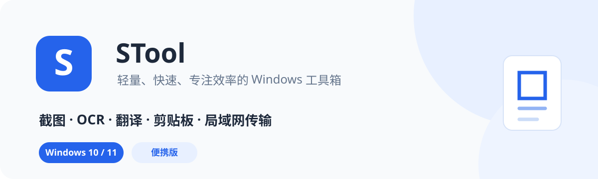
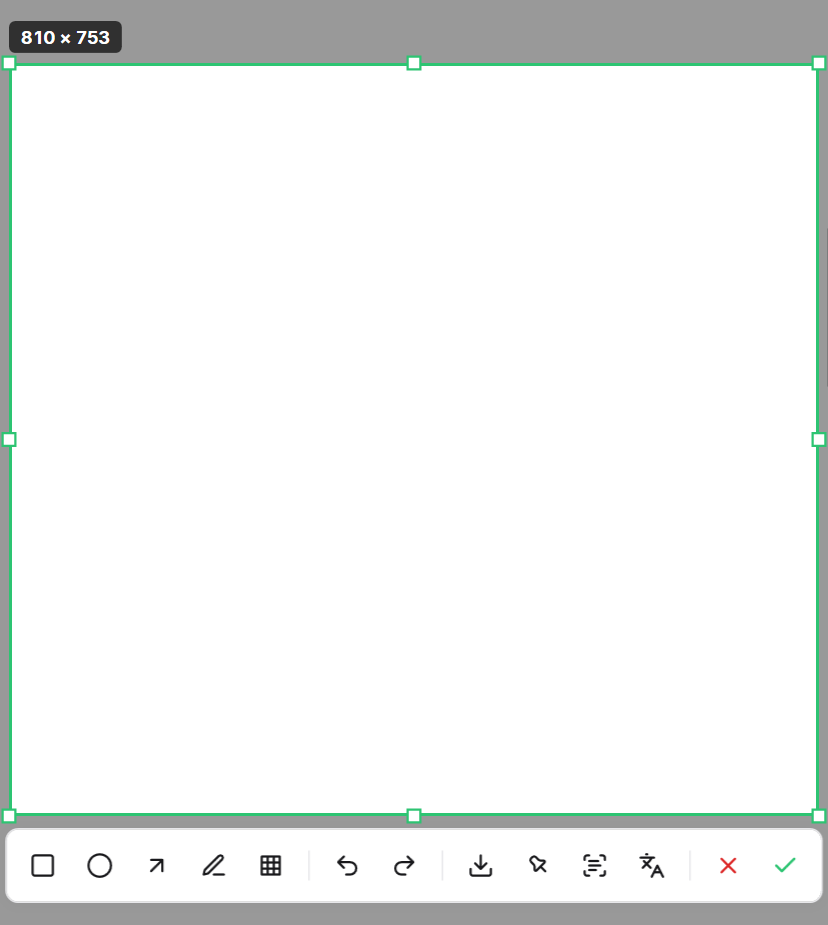
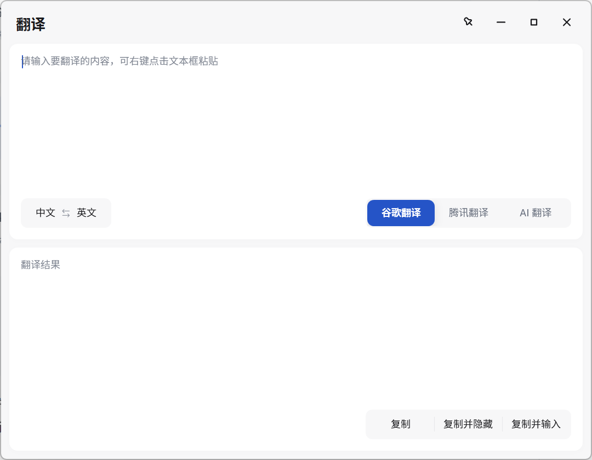
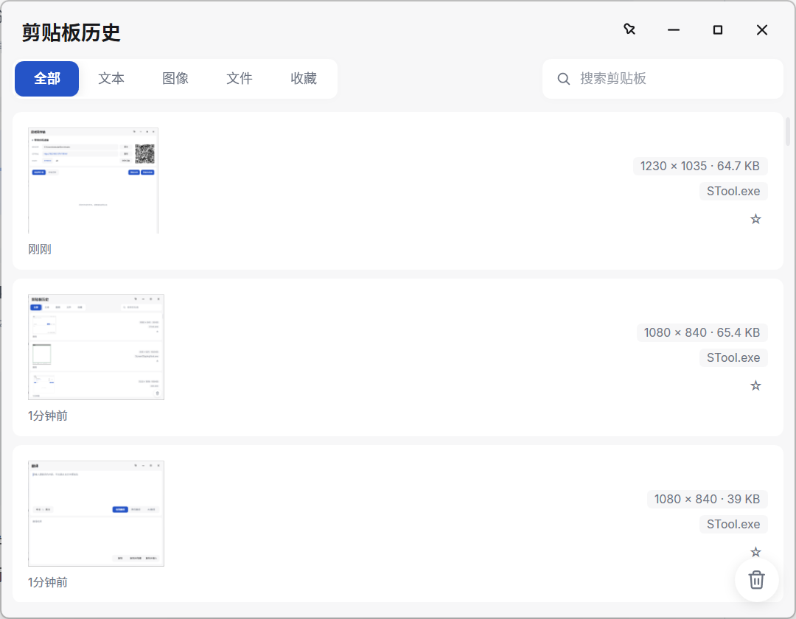
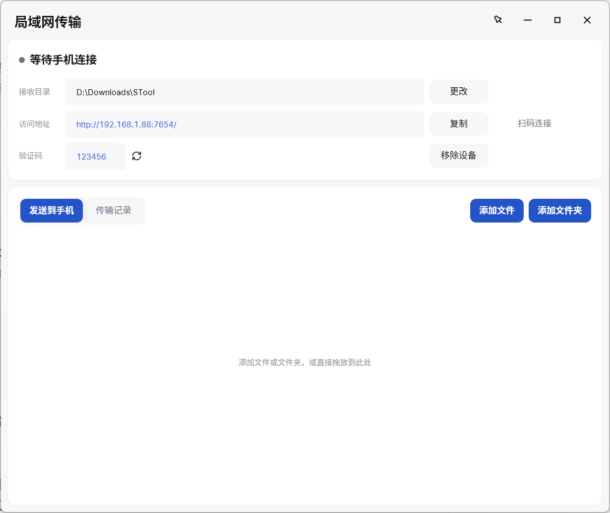
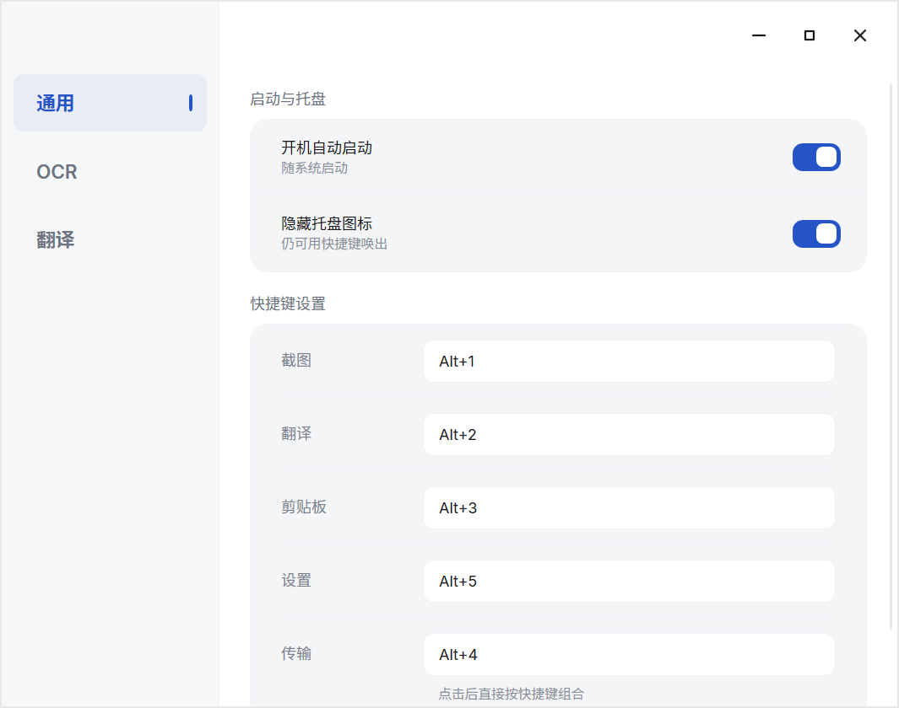

<p align="center">
  
</p>

<p align="center">
  把截图、文字识别、翻译、剪贴板历史和手机传文件，放进一个轻量的 Windows 工具里。
</p>

<p align="center">
  <a href="https://github.com/kabuda2077/STool/releases/latest"><strong>下载最新版本</strong></a>
  ·
  <a href="#快速开始">快速开始</a>
  ·
  <a href="#常见问题">常见问题</a>
</p>

---

## STool 是什么

STool 是一款面向 Windows 10/11 的桌面效率工具。它常驻系统托盘，需要时通过快捷键立即唤出，不需要在多个独立软件之间切换。

你可以用它完成这些日常操作：

| 功能 | 适合的场景 |
| --- | --- |
| 截图与标注 | 快速截取窗口或区域，添加矩形、椭圆、箭头、画笔和马赛克 |
| OCR 文字识别 | 从截图或图片中提取文字，保留原语言、标点和换行结构 |
| 文本与截图翻译 | 翻译复制的文字，或直接在截图位置覆盖译文 |
| 剪贴板历史 | 找回之前复制过的文本、图片和文件，并支持搜索、分类和收藏 |
| 局域网传输 | Android 手机通过浏览器扫码，与电脑双向传输文件和文件夹 |

STool 默认采用便携式存储：配置、剪贴板记录和日志都保存在程序同级的 `Data` 文件夹中，便于备份和迁移。

## 功能一览

### 截图：从按下快捷键到完成标注

按下 `Alt+1` 后，STool 会立即冻结当前屏幕。你可以点击识别窗口，也可以拖动选择任意区域。

<p align="center">
  
</p>

- 支持多显示器和高 DPI 缩放。
- 支持矩形、椭圆、箭头、画笔和马赛克标注。
- 支持撤销与重做。
- 可以复制、保存、钉在桌面、执行 OCR 或截图翻译。
- 截图窗口在显示前完成冻结，减少屏闪和画面错位。

### OCR：本地识别，也可以连接云端或 AI

STool 提供三类 OCR 方案：

- **Windows OCR**：完全本地运行，速度快，适合普通中英文内容。
- **腾讯云 OCR**：适合需要更稳定版面识别的场景。
- **AI Vision OCR**：适合复杂截图、混合语言、表格和需要理解上下文的图片。

如果云端服务异常，可以启用本地 OCR 兜底。未配置云端服务时，仍然可以直接使用 Windows OCR。

### 翻译：文字翻译和截图原位翻译

按下 `Alt+2` 打开翻译面板。输入或粘贴文字后，可以在 Google、腾讯和 AI 翻译之间切换。

<p align="center">
  
</p>

- 支持常用语言策略快速切换。
- 支持复制、复制并隐藏、复制并输入。
- 截图翻译提供快速模式和智能模式。
- 智能模式可以结合 AI 理解画面内容，并在原位置显示译文。

### 剪贴板：找回复制过的内容

按下 `Alt+3` 打开剪贴板历史。复制过的文字、图片和文件会按时间保存，避免因为下一次复制而丢失。

<p align="center">
  
</p>

- 按全部、文本、图像、文件和收藏分类查看。
- 支持关键词搜索和来源显示。
- 点击条目即可再次复制。
- 支持收藏、删除单条记录和按分类清空。
- 图片缩略图采用有界缓存，长时间浏览时不会无限增长内存。

### 局域网传输：手机无需安装客户端

按下 `Alt+4` 打开局域网传输面板。Android 手机与电脑连接同一个局域网后，使用浏览器扫描二维码即可访问。

<p align="center">
  
</p>

- 电脑可以拖入文件或文件夹，手机确认后开始接收。
- 手机可以多选文件或文件夹并发送到电脑。
- 支持暂停、继续、取消、断点续传和实时速度显示。
- 文件夹和多文件任务会根据发送方式生成 ZIP。
- 已完成任务进入传输记录，可以快速打开所在位置。
- 二维码默认记住设备，已认证设备可以在电脑端移除。
- 服务只在传输面板打开时运行，不会长期占用网络端口。

局域网传输不会主动向互联网开放。首次使用时，STool 会请求配置 Windows 监听权限和本地网络防火墙规则。

### 设置：常用功能集中管理

按下 `Alt+5` 打开设置。通用、OCR 和翻译配置分别放在独立页面，修改后自动保存。

<p align="center">
  
</p>

- 开机自动启动和托盘图标显示。
- 自定义截图、翻译、剪贴板、传输和设置快捷键。
- 配置 OCR、翻译和 AI 服务。
- API Key 支持加密保存和显示/隐藏。

## 快速开始

### 1. 下载

前往 [Releases](https://github.com/kabuda2077/STool/releases/latest)，下载：

```text
STool_v1.4.0_Portable.zip
```

### 2. 解压

将压缩包完整解压到一个固定目录，例如：

```text
D:\Apps\STool
```

不要直接在 ZIP 压缩包内运行，也不要只复制 `STool.exe`。正式版目录中还包含 SQLite 所需的原生组件。

### 3. 启动

双击 `STool.exe`。启动后程序会进入系统托盘，不会自动弹出主窗口。

### 4. 使用快捷键

| 默认快捷键 | 功能 |
| --- | --- |
| `Alt+1` | 截图 |
| `Alt+2` | 翻译 |
| `Alt+3` | 剪贴板历史 |
| `Alt+4` | 局域网传输 |
| `Alt+5` | 设置 |

快捷键可以在通用设置中修改。点击快捷键输入框后，直接按下新的组合键即可。

## 数据与隐私

STool 的用户数据默认保存在程序同级的 `Data` 文件夹：

```text
Data\
├─ config.json              配置文件
├─ clipboard.db             剪贴板数据库
├─ ClipboardImages\         剪贴板图片
├─ Logs\                    运行日志
├─ secure.key               本地加密密钥
├─ lan-devices.json         已认证局域网设备
└─ lan-transfer-history.json 传输历史
```

- API Key 等敏感字段使用 AES-GCM 加密保存。
- 剪贴板记录和图片不会因为关闭窗口而上传到网络。
- Windows OCR 在本地运行。
- 只有在你主动配置并使用腾讯云或 AI 服务时，相关文字或图片才会发送给对应服务商。
- 迁移时请复制整个 `Data` 文件夹；不要单独分享其中的配置或密钥文件。

## 更新、迁移与卸载

### 更新程序

1. 退出正在运行的 STool。
2. 下载并解压新版本。
3. 用新版本的程序文件替换旧文件。
4. 保留原来的 `Data` 文件夹。

### 迁移到另一台电脑

将整个 STool 目录复制到新电脑即可。为了保留配置、剪贴板记录和密钥，请确保 `Data` 文件夹一起复制。

### 卸载

先在设置中关闭“开机自动启动”，退出 STool，然后删除整个程序目录。STool 不会把业务数据写入 `%APPDATA%`。

## 系统要求

- Windows 10 或 Windows 11，64 位。
- [.NET 9 Desktop Runtime（x64）](https://dotnet.microsoft.com/download/dotnet/9.0)。
- 局域网传输需要电脑和手机处于可互相访问的同一网络。
- AI OCR、AI 翻译和腾讯云服务需要用户自行配置对应账号或 API。

## 常见问题

### 启动后为什么没有窗口？

STool 是托盘工具，正常启动后会隐藏到系统托盘。可以使用 `Alt+5` 打开设置，或点击托盘图标。

### 为什么双击程序没有反应？

STool 采用单实例运行。如果已经在后台运行，再次启动会尝试打开设置。请先检查系统托盘和任务管理器中的 `STool.exe`。

### 手机无法连接电脑怎么办？

确认手机与电脑处于同一个局域网，并在传输面板中完成“允许局域网访问”。如果更换网络，关闭并重新打开传输面板以刷新访问地址。

### OCR 或翻译失败怎么办？

先检查当前选择的服务。如果是云端或 AI 服务，请确认网络、API 地址、模型名称和密钥。Windows OCR 不需要联网，可以作为本地兜底。

### 更换程序目录后配置还在吗？

如果整个 `Data` 文件夹一起移动，配置和历史记录都会保留。只移动 `STool.exe` 会导致数据留在旧目录。

### 如何彻底隐藏托盘图标？

在通用设置中开启“隐藏托盘图标”。隐藏后仍然可以使用全局快捷键；再次运行 `STool.exe` 可以打开设置。

## 下载

最新稳定版：[STool v1.4.0](https://github.com/kabuda2077/STool/releases/latest)

项目主页：[github.com/kabuda2077/STool](https://github.com/kabuda2077/STool)
