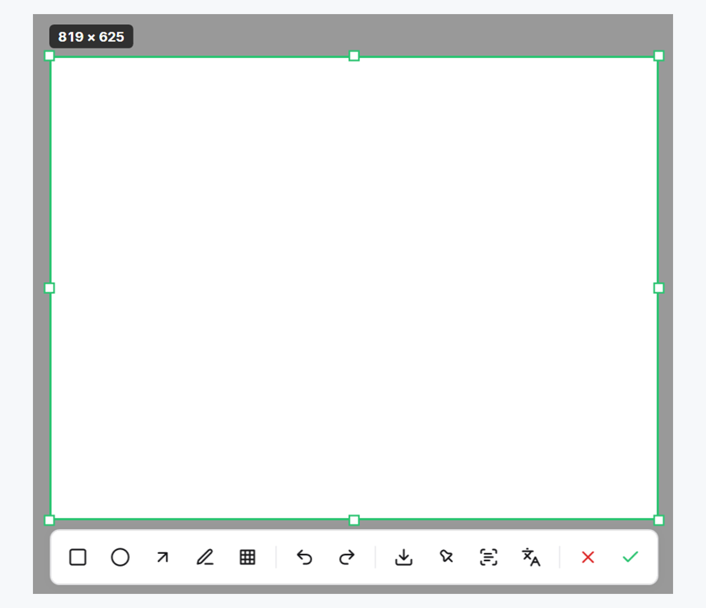
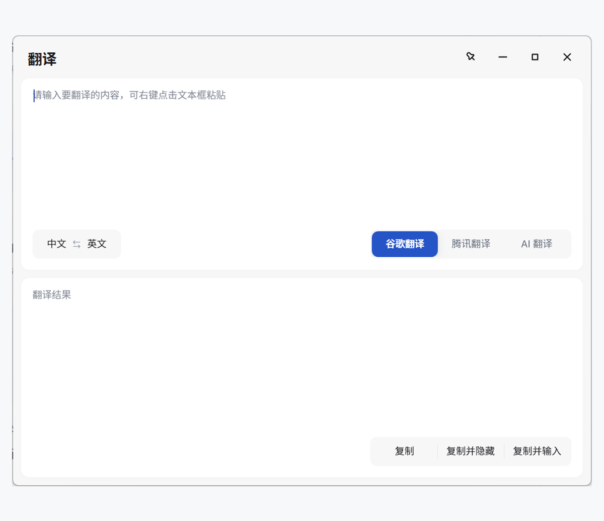
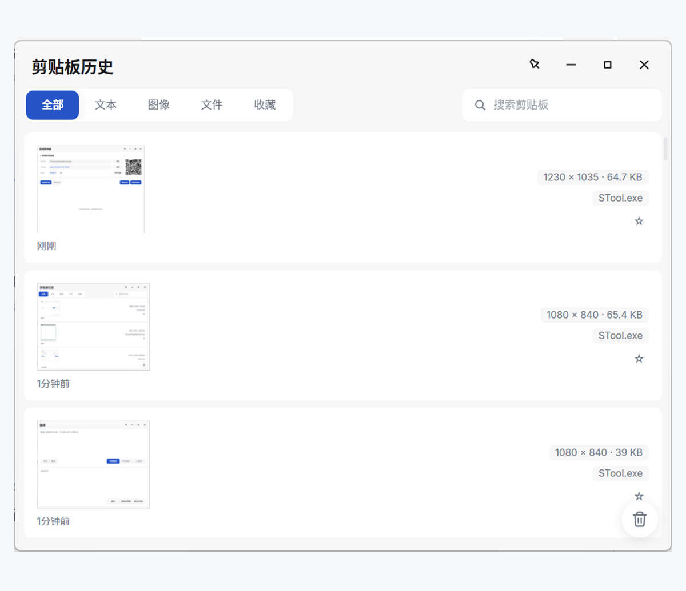
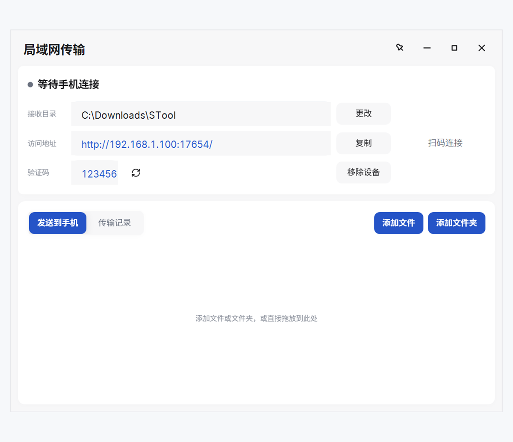

<p align="center">
  
</p>

<p align="center">
  把截图、文字识别、翻译、剪贴板历史和手机传文件，放进一个轻量的 Windows 工具里。
</p>

<p align="center">
  <a href="https://github.com/kabuda2077/STool/releases/latest"><strong>下载最新版本</strong></a>
  ·
  <a href="#快速开始">快速开始</a>
  ·
  <a href="#常见问题">常见问题</a>
</p>

---

## STool 是什么

这是一个非常个人向的 Windows 工具。把我日常使用频率最高的截图、OCR、翻译、剪贴板历史和局域网传输放到了一起，希望每项功能都能通过固定快捷键直接打开，并在同一套界面和工作流中完成。

STool 并不打算成为通用的应用启动器或插件平台。它舍弃了一部分扩展性和自定义能力，换取更短的操作路径、更紧密的功能联动，以及更可控的后台资源占用和使用体验。

如果你更需要应用启动、插件生态和高度自定义，可以了解优秀的 [ZTools](https://github.com/ZToolsCenter/ZTools)。

| 功能 | 说明 |
| --- | --- |
| 截图与 OCR | 截取、标注画面，并从图片中提取文字 |
| 翻译 | 翻译文字，或在截图原位置覆盖译文 |
| 剪贴板历史 | 找回复制过的文本、图片和文件 |
| 局域网传输 | 手机无需安装应用，扫码即可与电脑互传文件 |
| 便携式使用 | 配置和数据保存在程序目录，方便备份与迁移 |

## 界面展示

<table>
  <tr>
    <td width="50%" align="center">
      
      <br />
      <em>截图与 OCR</em>
    </td>
    <td width="50%" align="center">
      
      <br />
      <em>文字与截图翻译</em>
    </td>
  </tr>
  <tr>
    <td width="50%" align="center">
      
      <br />
      <em>剪贴板历史</em>
    </td>
    <td width="50%" align="center">
      
      <br />
      <em>局域网文件传输</em>
    </td>
  </tr>
</table>

## 核心功能

### 截图与 OCR

按下 `Alt+1`，点击窗口或拖动选择区域，即可完成截图、标注和文字识别。

- 支持多显示器、高 DPI、窗口识别和自由选区
- 提供矩形、椭圆、箭头、画笔、文字、马赛克和撤销重做，颜色与粗细可选
- 放大镜取色，方向键逐像素微调，Ctrl+S 直接保存
- OCR 可选择 Windows 本地、腾讯云或 AI Vision，并支持本地兜底

截图完成后可以直接复制、保存、钉在桌面、提取文字或执行截图翻译。

### 翻译

按下 `Alt+2` 快速翻译文字，也可以直接翻译截图中的内容。

- 支持 Google、腾讯和 AI 三种翻译引擎
- 支持常用语言策略以及复制、复制并隐藏、复制并输入
- 截图翻译提供快速模式和智能原位覆盖模式

### 剪贴板历史

按下 `Alt+3` 找回复制过的内容，不会因为下一次复制而丢失上一条记录。

- 按文本、图像、文件和收藏分类查看
- 支持搜索、来源显示、再次复制和收藏，重复复制的内容会移到最前
- 键盘操作：输入即搜索，↑↓ 选择，Enter 粘贴到原窗口，Esc 关闭
- 支持删除单条记录或按当前分类清空
- 自动跳过密码管理器标记为隐私的内容，可排除指定应用或随时暂停记录

### 局域网传输

按下 `Alt+4`，让 Android 手机与电脑连接同一局域网，再用浏览器扫码访问。

- 电脑可拖入文件或文件夹，手机确认后接收
- 手机可多选文件或文件夹发送到电脑
- 支持实时速度、暂停、继续、取消、断点续传和完成记录

服务只在传输面板打开时运行。首次使用时，STool 会引导配置 Windows 本地网络访问权限。

## 快速开始

1. 前往 [Releases](https://github.com/kabuda2077/STool/releases/latest)，下载 `STool_v1.5.0_Portable.zip`。
2. 将压缩包完整解压到固定目录，不要直接在 ZIP 内运行，也不要只复制 `STool.exe`。
3. 双击 `STool.exe`。程序启动后会进入系统托盘。
4. 使用快捷键唤出需要的功能。

| 默认快捷键 | 功能 |
| --- | --- |
| `Alt+1` | 截图 |
| `Alt+2` | 翻译 |
| `Alt+3` | 剪贴板历史 |
| `Alt+4` | 局域网传输 |
| `Alt+5` | 设置 |

快捷键可以在通用设置中修改。OCR、翻译服务和托盘行为也会在设置页自动保存。

<details>
<summary><strong>查看设置界面</strong></summary>

<p align="center">
  
</p>

</details>

## 数据与隐私

- 配置、剪贴板记录和日志默认保存在程序同级的 `Data` 文件夹。
- API Key 等敏感字段使用 AES-GCM 加密保存。
- Windows OCR 完全在本地运行；只有主动使用云端服务时，相关内容才会发送给对应服务商。
- 局域网传输不会主动向互联网开放。

<details>
<summary><strong>查看 Data 目录内容</strong></summary>

```text
Data\
├─ config.json                配置文件
├─ clipboard.db               剪贴板数据库
├─ ClipboardImages\           剪贴板图片
├─ Logs\                      运行日志
├─ secure.key                 本地加密密钥
├─ lan-devices.json           已认证局域网设备
└─ lan-transfer-history.json  传输历史
```

迁移程序时请复制整个 `Data` 文件夹，不要单独分享其中的配置或密钥文件。

</details>

## 更多信息

<details>
<summary><strong>更新、迁移与卸载</strong></summary>

### 更新

退出 STool，解压新版本并替换旧程序文件，同时保留原来的 `Data` 文件夹。

### 迁移

将整个 STool 目录复制到新电脑即可。确保 `Data` 文件夹和程序一起移动。

### 卸载

先在设置中关闭“开机自动启动”，退出 STool，然后删除整个程序目录。STool 不会把业务数据写入 `%APPDATA%`。

</details>

<details>
<summary><strong>系统要求</strong></summary>

- Windows 10 或 Windows 11，64 位
- [.NET 9 Desktop Runtime（x64）](https://dotnet.microsoft.com/download/dotnet/9.0)
- 局域网传输需要电脑和手机处于可互相访问的同一网络
- AI OCR、AI 翻译和腾讯云服务需要用户自行配置对应账号或 API

</details>

## 常见问题

### 启动后为什么没有窗口？

STool 是托盘工具，正常启动后会隐藏到系统托盘。可以使用 `Alt+5` 打开设置，或点击托盘图标。

### 为什么双击程序没有反应？

STool 采用单实例运行。如果已经在后台运行，再次启动会尝试打开设置。请先检查系统托盘和任务管理器中的 `STool.exe`。

### 手机无法连接电脑怎么办？

确认手机与电脑处于同一局域网，并在传输面板中完成“允许局域网访问”。更换网络后，重新打开传输面板以刷新地址。

### OCR 或翻译失败怎么办？

检查当前服务的网络、API 地址、模型名称和密钥。Windows OCR 不需要联网，可以作为本地兜底。

### 更换程序目录后配置还在吗？

整个 `Data` 文件夹一起移动时，配置和历史记录都会保留。只移动 `STool.exe` 会让数据留在旧目录。

## 下载

最新稳定版：[STool v1.5.0](https://github.com/kabuda2077/STool/releases/latest)

项目主页：[github.com/kabuda2077/STool](https://github.com/kabuda2077/STool)
